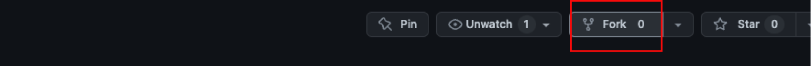
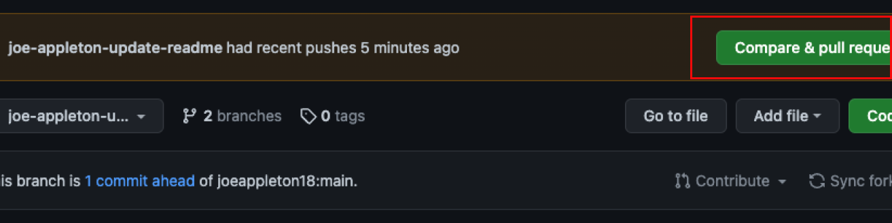

# Week 1 Notes 

This week, we will address the following questions:

1. What is DevOps?
2. What are the assessments?
3. How will the module work?
4. How can we collaborate as team members

## Lesson Dependencies

- [Git installed](https://git-scm.com/book/en/v2/Getting-Started-Installing-Git)

## What Is DevOps?

Software Engineering, like any human-focused endeavour, is not an exact science. As such, definitions can be troublesome. However, we should at least try to consider industry narratives surrounding DevOps.

DevOps is a reaction to the change in the way teams deliver software. Speaking broadly, you will know two different development methodologies: agile and waterfall. Both focus on teams delivering software. However, the waterfall method follows a linear development path, whereas Agile has quick iterations, known as sprints. Agile was a response to the slow release cycles advocated by the waterfall method. However, while the iterative cycles addressed this issue, development and operations teams still functioned in isolation.

::: tip DEFINITION
:book: **Development**

Responsible for developing the features of a software product.
:::

::: tip DEFINITION
:book: **Operations**

Responsible for maintaining the uptime of the production, staging, and development environment.
:::

> > [DEVOPS INTEGRATES the two worlds of development and operations, using automated development, deployment, and infrastructure monitoring]()

DevOps is a culture that combines the historically separate functions of Development and Operations. It is a relatively new idea, widely credited to [Patrick Debois](https://twitter.com/patrickdebois?ref_src=twsrc%5Egoogle%7Ctwcamp%5Eserp%7Ctwgr%5Eauthor), the organiser of the 2009 DevOpsdays conference. Since this time, [according to the team at Amazon Web Services](https://docs.aws.amazon.com/whitepapers/latest/introduction-devops-aws/welcome.html), DevOps consists of the following functions:

- Continuous Integration
- Continuous Delivery/Deployment
- Infrastructure as Code
- Monitoring and Logging
- Communication and Collaboration

::: warning TASK

## Task 1: Discussing DevOps

**Time: 30 mins**

What does DevOps mean to you in your groups.

:::

## How are we going to learn DevOps?

::: tip Important Point
:star:

This course focuses on DevOps and not how to program. While we will explore a real-world sample program and construct a CI/CD pipeline around it, I will not be overly focused on the underlying technology. For your assessment, and to fully understand the in-class examples, you will need to explore the underlying technology in your own time.

:::

The above question is tricky to answer. The reality is that a university project does not require sophisticated DevOps tooling. However, it would be remiss to deny you an overview of the latest industry techniques. Nonetheless, the reality is that we will only be able to scratch the surface of what is possible. I want you to think of this module as a flavour of what DevOps is.

This course focuses on DevOps and not how to program. While we will explore a real-world sample program and construct a CI/CD pipeline around it, I will not be overly focused on the underlying technology. For your assessment, and to fully understand the in-class examples, you will need to explore the underlying technology in your own time.

## Working in Teams (Communication and Collaboration)

Communication and collaboration is one of the key tenants of DevOps. However, it’s not always immediately obvious how collaboration works when developers are working on the same code base. Version control, specifically Git, has us covered here. As such, in this first week, I want to consider how we might collaborate. 

[According to Atlassian, there are four ways to collaborate using Git:](https://www.atlassian.com/git/tutorials/comparing-workflows)

- Centralized Workflow
- Feature Branch Workflow
- GitFlow Workflow
- Forking Workflow

Today, we will consider the feature branch workflow. Using such a workflow, we construct each feature on a dedicated branch.

::: tip Important Point
:star:

[Throughout this course, I am going to be incrementally releasing versions of a room tracking application; this will serve as our sample project.](Throughout this course, I am going to be incrementally releasing versions of a room tracking application (https://github.com/joeappleton18/solent-room-finder); this will serve as our sample project.  )  

:::

Let’s consider how we might use a feature workflow using our room tracking application.  

::: warning TASK 2: Collaboration

1. Team up with between two and three people 

2. [One team member (a team leader) should fork the class repository; this will give them a copy of the repository.](https://github.com/joeappleton18/solent-room-finder) 

3.  Next, in the GitHub repository settings, the team leader should add their team as as collaborators. 

4. Each team member should clone the team leaders’ repository: `git clone <address>`

5. Each team member should now checkout a feature branch called `<your-name-updating-readme>`: `git checkout -b joe-appleton-updating-readme`

6. Each team member should add their name to the bottom of the README.md file and commit the changes: `git add -A` && `git commit -m updated readme`

7. Push your feature branch to the upstream git repository: `git push origin <your-branch-name>`

8. Each team member should navigate to their branch on GitHub and raise a pull request.

9.  The team leader should review and merge each pull request

::: 

## Further Work

[Complete my side tutorial, introducing the technologies we will be using for this module.](/side-tutorials/1.creating-a-next-and-tail-wind-application.html#video-assets) 

