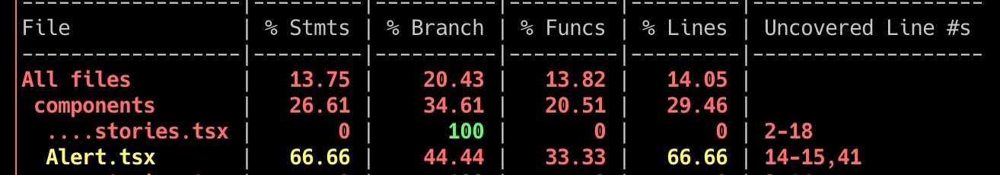
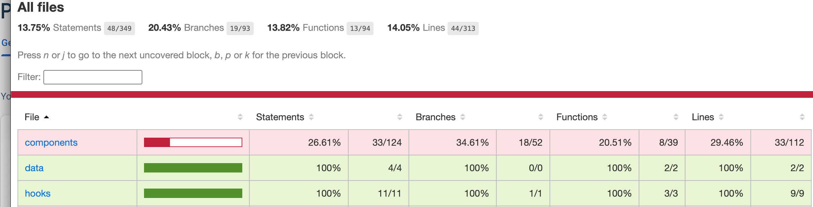
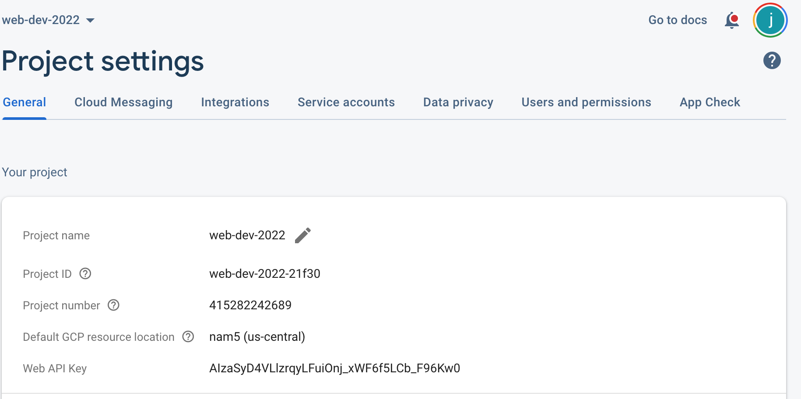

# Week 10: Monitoring and Logging 

We are nearly there! Recall, way back in week-1, I introduced the basic principles of DevOps:

- Continuous Integration
- Continuous Delivery/Deployment
- Infrastructure as Code (beyond the scope of the module)
- Monitoring and Logging
- Communication and Collaboration

This week we will consider Monitoring and Logging by addressing the following questions:

- How can I monitor what is tested?
- How can I log application events in a way that I can easily diagnose problems?
- How can I understand how users are interacting with my application?

## Lesson Dependencies 🔨

- [You will need to ensure you have the version control tool Git installed](https://git-scm.com/book/en/v2/Getting-Started-Installing-Git)
  - You'll need to know the basic Git Commands (e.g., `checkout -b`, `push`, and `commit`)
- While you can use any text editor for this session, I recommend that you install [VS Code](https://code.visualstudio.com/download)
- You will need access to a MongDB database.
  - You can install your own locally
  - Use [AtlasDB](https://www.mongodb.com/atlas/database)
- [You need a Cloudinary account](https://cloudinary.com/)
- [You need a GitHub account](https://www.github.com)

## TASK 0: Get the Starter Application

If you have a working version of the room finder with authentications, you don't need to get a new version of the project. If not,

In your command line shell, run:

```shell
git clone --branch week-10-starter-code  https://github.com/joeappleton18/solent-room-finder.git week-10
```

[Next, follow the setup steps from week 7](../week-7/#task-0-1-get-the-starter-application)


## What to Measure? 


There are several measurement techniques that can be used in a DevOps environment to monitor and improve the performance and reliability of software systems. These techniques include:

1. Monitoring: Continuous monitoring of key metrics, such as system performance, availability, and error rates, can provide teams with real-time insights into the health and stability of their systems.

1. Dashboards: Dashboards can be used to visualise key metrics and to provide teams with an overview of the current state of their systems.

1. Log analysis: Log analysis can be used to identify trends and patterns in system behavior, and to quickly identify and diagnose issues.

By using these measurement techniques, teams can gain a better understanding of their systems, and can use this information to make informed decisions about how to improve the performance and reliability of their software.

This week, I would like to quickly introduce a few methods to gain a better understanding of our room tracking application.

## Code Coverage


::: tip DEFINITION
:book: **Term**

Code coverage is a measure of how much of your code is executed when running tests. It helps you determine how thoroughlyyour tests exercise your code, and helps you identify areas of your code that may not be fully tested. By ensuring that your tests have high code coverage, you can improve the quality and reliability of your software.

:::

Currently, we have two types of tests in our room-finder project: unit tests (using the react testing library running jest) and integration tests (running on Cypress). Let's consider how we can generate coverage reports for both of our testing scenarios:

### Jest Code Coverage 

To check code coverage using Jest, you need to use the --coverage flag when running your Jest tests. For example:

```
npx jest --coverage --collectCoverageFrom="./src/**"

```

Running the above command will generate a coverage report that looks something like this:




Personally, I don't find the above coverage format that useful. A better approach is to generate a coverage report like this:
   

```
npx jest --coverage --collectCoverageFrom="./src/**" --coverageD directory='coverage'

```

Now, you will see an interactive coverage report, in `/coverage/lcov-report/index.html` that resembles this:




>> A interactive coverage report; this would look much better in the appendix of your report!


Hmm, 44 of 313 lines of code are tested: not great! We better look at our Cypress coverage report.


### Cypress Code Coverage

[According to the Cypress documentation, in order to generate a coverage report, we must first instrument our code.](https://docs.cypress.io/guides/tooling/code-coverage#Instrumenting-code). Code instrumentation provides us with information about the sections of code that are invoked when tests are run. Cypress is unopinionated about how we instrument our code. However, Istanbul is considered to be the industry standard JavaScript instrumentation tool. With this in mind, let's consider how to integrate Instanbul with Cypress.

First, install the Cypress Coverage and Istanbul dependencies by running:

```bash

npm install -D  babel-plugin-istanbul @cypress/code-coverage


```

Next, create a `.babelrc` file in the root of your project, and add the following code:

```js

{
	 "presets": ["next/babel"],
	 "plugins": ["istanbul"]
}

```
>> `.babelrc`

We now need to update two of our cypress files: `cypress/support/e2e.js` and `cypress.config.ts`. Add the following code:

```js
// cypress/support/e2e.ts
import '@cypress/code-coverage/support'
```
>>  `cypress/support/e2e.ts`

```js
// cypress.config.ts
const { defineConfig } = require('cypress')

module.exports = defineConfig({
  // setupNodeEvents can be defined in either
  // the e2e or component configuration
  e2e: {
    setupNodeEvents(on, config) {
      require('@cypress/code-coverage/task')(on, config)
      // include any other plugin code...
      
      // It's IMPORTANT to return the config object
      // with any changed environment variables
      return config
    }
  }
})

```

>> `cypress.config.ts`

Now if you run cypress (`npm run test` and then  `npm run cypress:run`), you should get an updated coverage report in: `/coverage/lcov-report/index.html`.  As you can see, our coverage is now around 85%, much better:


>> updated coverage report: notice how `@cypress-coverage` is more focused, meaning there are less lines of code analysed

### Task 1 

Using the notes above, set up test coverage in our room-finder application.


## Logging 


Currently, there is no way of knowing if our production application has crashed! As such, we need a  logging solution that helps us diagnose and monitor application issues. 

[I recommend using Sentry](sentry.io).  Sentry is a platform that helps developers monitor and fixes errors in their applications in real time. It is often used to detect and report errors, as well as track the performance of an application and identify potential issues. This can help developers quickly identify and fix problems, ensuring that their applications are stable and running smoothly.

Sentry's SDK hooks into your runtime environment and automatically reports errors, uncaught exceptions, and unhandled rejections as well as other types of errors depending on the platform.


## Task 2: Configure Sentry in Your Room Finder Application


Put simply, the Sentry documentation is excellent and walks you through the installation process. For this task, sign up to a [sentry.io](http://sentry.io) account and follow through the installation instructions for a Next.js application. 


Once you have Sentry set up, you may want to add some further context to your errors. [See if you can figure out how to append the logged in user's details to the error](https://docs.sentry.io/platforms/javascript/guides/react/enriching-events/identify-user/)

## Analytics 

Finally, I want to consider analytics. You should include some form of analytics solution in your assessment. Analytics allow you to understand how users are interacting with your web application. I recommend considering Google analytics Combined with HotJar.

Google Analytics is a free web analytics service offered by Google that tracks and reports website traffic. 
Hotjar is a tool that provides website and user analytics, as well as feedback and survey tools. It allows you to see how users are interacting with your website by visually representing their clicks, taps, and scrolling behaviour. This can help you identify problem areas and improve the overall user experience of your website. 

## Task 3: Installing Analytics 

Install analytics on our room finder application. I recommend you use the following tutorial:

[Google Analytics and HotJar Install](https://medium.com/@romansorin/using-hotjar-and-google-analytics-with-next-js-to-track-behavior-a2283d659767)

## THE END  
