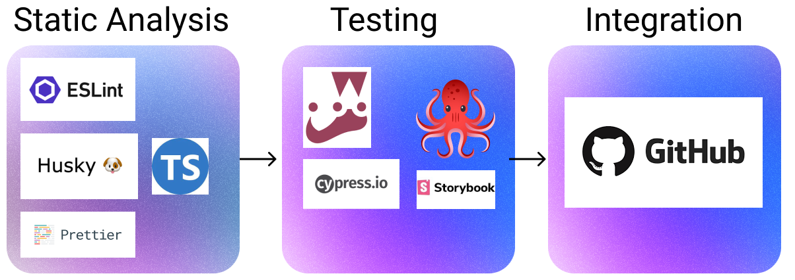
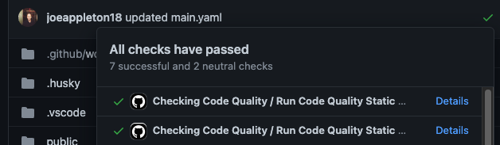

# Week 2: Static Code Analysis (ii)



This week, we will complete the static analysis rung of the CI pipeline. In doing so, we'll add code formatting to the room-checking sample application. Further, we'll put in place checks to ensure that code that does not comply with our linting and formatting rules does not end up in our codebase.

Throughout this week, we will be addressing the following questions:

1. How can we ensure that a team follows a consistent coding standard?
1. How can we enforce these standards?
1. How can we integrate these standards into our CI/CD pipeline?
1. How can I deploy my web applications?

## Lesson Dependencies 🔨

- [You will need to ensure you have the version control tool Git installed](https://git-scm.com/book/en/v2/Getting-Started-Installing-Git)
  - You'll need to know the basic Git Commands (e.g., `checkout -b`, `push`, and `commit`)
- While you can use any text editor for this session, I recommend that you install [VS Code](https://code.visualstudio.com/download)

### Getting the week two starting code base

In your command line shell, run:

```shell

git clone --branch week-3-starter-code https://github.com/joeappleton18/solent-room-finder.git solent-room-finder-week-3

- Navigate into the created  `solent-room-finder` folder: `cd solent-room-finder-week-3`
- Install the dependencies: `npm install`
- Run the development server: `npm run dev`
- Open [http://localhost:3000](http://localhost:3000) with your browser to see the result.

```

## TASK 1: Set up

::: warning TASK 1: Set up
Follow the steps above to, ensure you have the lesson dependencies set up: including the starting code base.
:::

## Prettier

Prettier is an opinionated code formatter; however, as you have seen, last week, our linter already formats code (to a degree). It may at first seem similar to a linter; however, on closer inspection, there are some subtle differences:

- Linters are mostly worried about code quality: eg no-unused-vars, no-extra-bind, no-implicit-globals, prefer-promise-reject-error

- Prettier prints your whole program from scratch applying only formatting rules: eg: max-len, no-mixed-spaces-and-tabs, keyword-spacing, comma-style. As a developer, you never have to worry about formatting your code again.

## TASK 1: Installing Prettier

::: warning TASK 1: Installing Prettier

Let's get going with prettier awesomeness:

1. Install the dependencies: `npm install --save-dev eslint-config-prettier prettier`
2. Notice how we installed `eslint-config-prettier` along with `prettier`.
   ESlint can do some formatting for us; however, we don't want it to conflict with prettier. The `eslint-config-prettier` package ensures that only prettier's formatting rules are used. We can use it by adding `prettier` to the extends array of our `eslintrc.json` file:

````json
`eslintrc.json`

```JavaScript
{
  ...
  "extends": [
    "next/core-web-vitals",
    "eslint:recommended",
    "plugin:@typescript-eslint/recommended",
    "prettier"
  ],
 ....
}
````

> > `eslintrc.json`: adding prettier

- You can now run prettier: `npx prettier --write .`. This command will automatically fix the formatting in your code.

- [Like ESlint, there is a VS code plugin for prettier](https://marketplace.visualstudio.com/items?itemName=esbenp.prettier-vscode). Install the plugin.

- We can now update our `./vscode/settings.json` file to auto format on save:

```json
{
  "editor.codeActionsOnSave": {
    "source.fixAll.eslint": true,
    "source.fixAll.format": true
  },
  "eslint.validate": ["javascript"],
  "editor.defaultFormatter": "esbenp.prettier-vscode"
}
```

> > .vscode/settings.json: these are what my final settings look like

- Finally, in your route directory create the following two files: `.prettierignore` and ` .prettierrc.json`. `.prettierrc.json` allows us to add custom rules, let's add the following:

```json
{
  "printWidth": 80,
  "bracketSpacing": false
}
```

`.prettierrc.json`: Prettier already has a solid rule set; above, I am tweaking it to my preferences. [Have a play in the playground if you want to add further rules](https://prettier.io/playground/)

:::

## Husky

If you've got this far, you've come a long way: give yourself a pat on the back. However, we are not quite finished. Would it not be nice if we could automatically run checks (e.g., linting, formatting, testing, and type checking) before each commit. This is where Husky comes into play.

[According to the developers, "Husky improves your commits and more 🐶 woof! You can use it to lint your commit messages, run tests, lint code, etc... when you commit or push. Husky supports all Git hooks.](https://typicode.github.io/husky/#/)

## TASK 2: Installing Husky

::: warning TASK 5: Install Husky

- npx husky-init && npm install
- Next, we need to set up some scripts in our package.json file, these will run on each commit

  ```json

  "scripts":
  	...
  	"prettier": "prettier --write .",
    	"types": "tsc",
  	...
  ```

  > > > `package.json`: updated rules

- Finally, tell Husky which scripts to run in the `.husky/pre-commit` file. Your file should resemble the below:

```bash
#!/usr/bin/env sh
. "$(dirname -- "$0")/_/husky.sh"

echo "running pre-commit checks"

## prettier

npm run  prettier
npm run types
npm run lint
```

- Now, when you make a commit the above checks should run. If they fail, your code won't be committed.
  :::

## GitHub Workflows

A recent addition to GitHub is something known as workflows.

According to GitHub, "Workflows are defined in the .github/workflows directory in a repository, and a repository can have multiple workflows, each of which can perform a different set of tasks. For example, you can have one workflow to build and test pull requests, another workflow to deploy your application every time a release is created, and still another workflow that adds a label every time someone opens a new issue."

This is a very exciting prospect; we can use workflows to automate repetitive jobs. Today, we will consider how we can automate our static code checking on both a pull request to our room checker's master branch and a push request to any branch. Moving forward, we can define jobs that build and test our room-checking application. Over the course of a project, this could save you hours of manual, tedious labour.

## Task 3: Our First Workflow

::: tip Important Point
:star:

If you can't push and you are sure you are the only one working on branch you can use: ` git push origin <branch-name> --force`

:::

:: warning TASK 5: Our First Workflow

Let's create a workflow that will check the quality of code being committed to our remote repository.

- [First, read the first page of the GitHub actions documentation](https://docs.github.com/en/actions/quickstart)
- In your room finder project, create the `.github/workflows/` directory to store your workflow files.
- Create a file in `.github/workflows/` called `main.yaml`
- Add the following code to `main.yaml`

```yaml
name: Checking Code Quality
on: ["push", "pull"] ## run on push and pulls
jobs:
  eslint:
    name: Run Code Quality Static Checks ## the name of our job
    runs-on: ubuntu-latest
    permissions:
      contents: read
      security-events: write
      actions: read # only required for a private repository by github/codeql-action/upload-sarif to get the Action run status
    steps:
      - name: Checkout code
        uses: actions/checkout@v3
      - name: Install Dev Dependencies
        run: npm install --only=dev
      - name: Run ESLint
        run: npm run lint
        continue-on-error: true
```

> > [To understand what the above code snippet does, read the GitHub actions documentation](https://docs.github.com/en/actions/quickstart)

- Commit your changes
- Next, switch to a `main` branch: `git checkout -b main`
- Set up a GitHub repository to hold your project, and grab the remote address
- Remove the existing remote address: `git remote remove origin`
- Add your repository's remote address: `git remote add origin < your address>`
- Push to your remote repository: `git push origin main`
- If all has worked well, there should now be a green tick on the top of your repository:



- You can also verify your job has run by clicking the actions button at the top of your repository:


1. Can you expand `main.yaml` to also check types and run prettier?
2. Check out a new branch push to the remote and raise a pull request you should get a detailed report on the status of the jobs that have run.
3. **Bonus Task:** [GitHub actions has a marketplace of actions we can use](https://github.com/marketplace?type=actions). Can you use the marketplace to create a new job that does something interesting. [This project management example sparked my interest](https://docs.github.com/en/actions/managing-issues-and-pull-requests/moving-assigned-issues-on-project-boards). [You can also do things like update discord on a pull request](https://github.com/marketplace/actions/discord-message-notify)

:::

### Task solutions

> > Solution corresponding to the task step number. You should attempt the task before you look at the solutions 😆.

::: details SOLUTION (1) Click me to view the code

```yaml
...
 - name: Run Prettier
        run: npm run prettier
  - name: Check Types
	run: npm run types
...
```

:::

## Task 4: Our First Workflow

Using what you have learnt so far:

- Static checking
- Automation (Huskey, GitHub Actions)

Create a starter Next.js project, and enforce coding standards and type checking: this will be useful for your assessment.

## Further Reading

### TypeScript

- [The TypeScript Hand Book, well worth flicking through∫](https://www.typescriptlang.org/docs/handbook/intro.html)

## Code Formatting and Linting

- [Check out all the formatting rules you can use for prettier](https://prettier.io/playground/)

## GitHub Workflows

- [GitHub Workflows](https://docs.github.com/en/actions/using-workflows/about-workflows)
