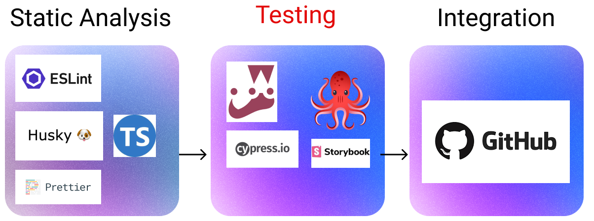
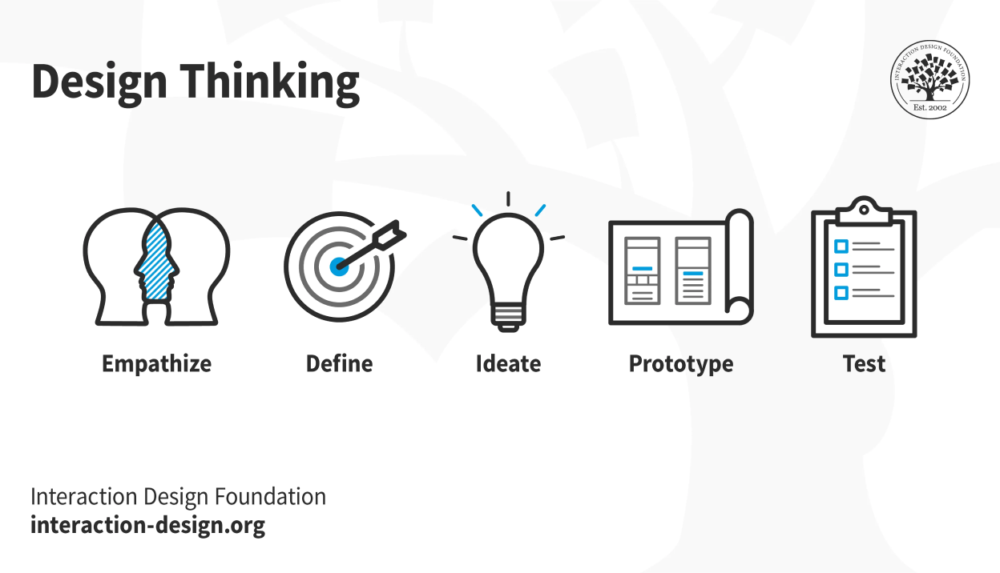
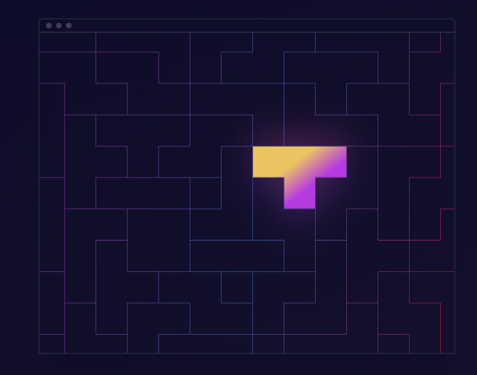
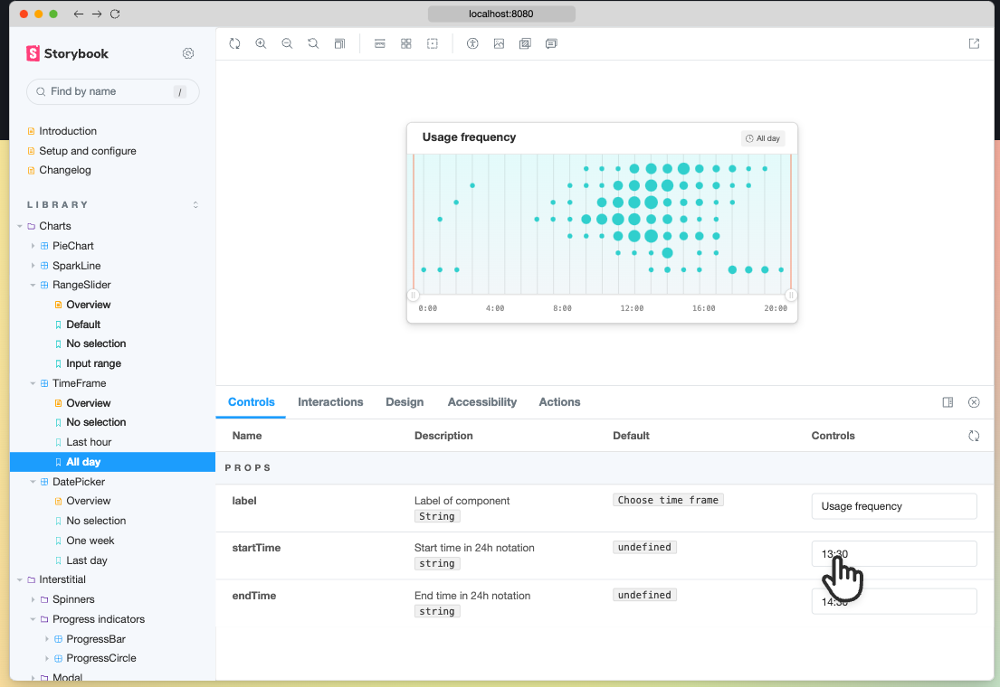
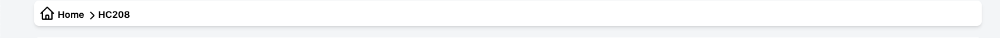
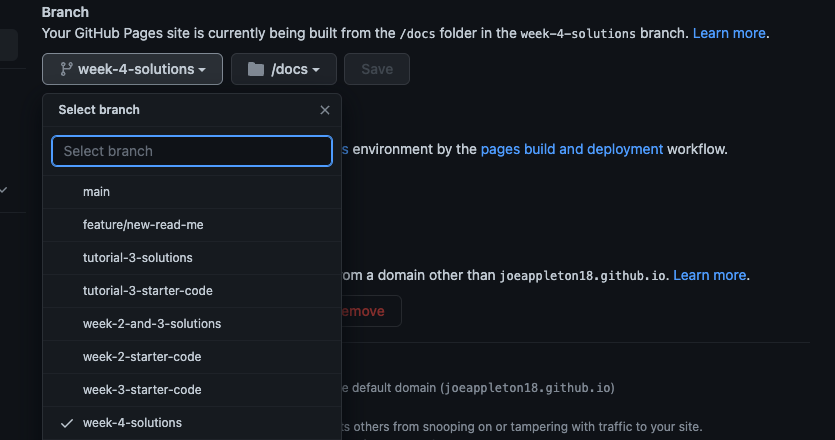

# Week 4: Component Driven Development



This week, we are continuing our exploration into CI/CD process. In doing so, we will consider component-driven development (CDD). This marks a move onto the testing portion of our CI pipeline.

Throughout this week, we will be addressing the following questions:

1. How can we make quick, agile iterations of a software product?
2. How can we use CDD to allow teams to compose applications using re-usable components?
3. How can we document and share the functionality of our components?
4. How can we integrate the components' documentation into our CI/CD pipeline?

# Lesson Dependencies 🔨

- [You will need to ensure you have the version control tool Git installed](https://git-scm.com/book/en/v2/Getting-Started-Installing-Git)
  - You'll need to know the basic Git Commands (e.g., `checkout -b`, `push`, and `commit`)
- While you can use any text editor for this session, I recommend that you install [VS Code](https://code.visualstudio.com/download)

## TASK 0: Get the Starter Application

::: warning TASK 0: Getting Started

Since we now have a database, set up is a little more involved:

In your command line shell, run:

```shell
git clone --branch week-4-starter-code https://github.com/joeappleton18/solent-room-finder.git solent-room-finder-week-4
```

- Follow the instructions in the cloned project's readme to set up the project.

:::

## The Why?



> > The design thinking process: 1. Empathize, 2. Define, 3. Ideate, 4. Prototype and 5. We can use DevOps to support us in this process (image source: [Interaction Design Foundation](https://www.interaction-design.org/literature/article/what-is-design-thinking-and-why-is-it-so-popular))

To understand the why behind CDD, we must first consider what we intend to achieve in developing a given application.

For me, it's not about using the latest tools and tricks; rather, it is a process of solving problems for the end user through the iterative experimentation of new concepts and ideas. The idea of design thinking captures this idea. Design thinking involves the continual experimentation and iteration of design prototypes.

::: tip DEFINITION
:book: **Software Development**
Is a process of solving problems for the end user through the iterative experimentation of new concepts and ideas.
:::

Often, at university (particularly at Solent), we focus too much on tools, forgetting that these tools exist to solve problems for the end user by supporting an iterative design process.

## TASK 1: Considering What Software Development Is

::: warning TASK 1: Considering What Software Development Is

With the above in mind, let's consider further what we are trying to achieve for the assessment scenario. Yes, we are making an application to share recipes, however:

- What is the end user trying to achieve through interacting with your application? You may find it useful to narrow the application down (e.g., recipes for students, recipes for fitness)?

In groups of 2 - 5, discuss the above question and capture the outcomes in a [figma jam file](https://www.figma.com/)

:::

## Component Driven Development (CDD)

CDD is well aligned with the definition, sketched out above, of the purpose of software development: solving problems for the end user through the iterative experimentation of new concepts and ideas.



> > CDD allows us to treat our application as a puzzle. (image source: [https://www.componentdriven.org/](https://www.componentdriven.org/)

CDD is well aligned with the definition, sketched out above, of the purpose of software development: solving problems for the end user through the iterative experimentation of new concepts and ideas.

According to [componentdriven](https://www.componentdriven.org/), Components are standardized, interchangeable building blocks of UIs. They encapsulate the appearance and function of UI pieces. Think LEGO bricks. LEGOs can be used to build everything from castles to spaceships; components can be taken apart and used to create new features.

Using components, we can quickly reconfigure and test how our application works. **However, this idea depends on the premise that components can be easily discovered and used, often this is not the case**!

## Storybook to the rescue



> > Storybook solves the problem of component reuse and discoverability. (image source: [https://storybook.js.org/](https://storybook.js.org/)

Storybook solves the problem of component reuse and discoverability. It is an open-source UI tool for building components in isolation. In summary, it allows you to create, test, and document your application's components.

## TASK 2: Getting Started With Story Book

::: warning TASK 2: Getting Started With Storybook

Storybook lives alongside an existing project. It allows us to create living documentation that updates in line with our project!

https://storybook.js.org/docs/react/get-started/install
To install story book, run the following command:

- `npx storybook init`

This will create some sample stories: `src/stories` and a config folder `.storybook`. You can now run story book: `npm run storybook`

Since we are using tailwind, we need to install a few further dependencies to allow tailwind to process our css. Run the command:

- npm install -D @storybook/addon-postcss

- Next, overwrite the `.storybook/main.js` and `.storybook/preview.js` with the code snippets below:

```js
const path = require("path");

module.exports = {
  stories: ["../src/**/*.stories.mdx", "../src/**/*.stories.@(js|jsx|ts|tsx)"],
  /** Expose public folder to storybook as static */
  staticDirs: ["../public"],
  addons: [
    "@storybook/addon-links",
    "@storybook/addon-essentials",
    {
      /**
       * Fix Storybook issue with PostCSS@8
       * @see https://github.com/storybookjs/storybook/issues/12668#issuecomment-773958085
       */
      name: "@storybook/addon-postcss",
      options: {
        postcssLoaderOptions: {
          implementation: require("postcss"),
        },
      },
    },
  ],
  core: {
    builder: "webpack5",
  },
  webpackFinal: (config) => {
    /**
     * Add support for alias-imports
     * @see https://github.com/storybookjs/storybook/issues/11989#issuecomment-715524391
     */
    config.resolve.alias = {
      ...config.resolve?.alias,
      "@": [path.resolve(__dirname, "../src/"), path.resolve(__dirname, "../")],
    };

    /**
     * Fixes font import with /
     * @see https://github.com/storybookjs/storybook/issues/12844#issuecomment-867544160
     */
    config.resolve.roots = [
      path.resolve(__dirname, "../public"),
      "node_modules",
    ];

    return config;
  },
};
```

> > .storybook/main.js

```js
import * as NextImage from "next/image";
import "../src/styles/globals.css";

const OriginalNextImage = NextImage.default;

Object.defineProperty(NextImage, "default", {
  configurable: true,
  value: (props) => <OriginalNextImage {...props} unoptimized />,
});

export const parameters = {
  actions: { argTypesRegex: "^on[A-Z].*" },
  controls: {
    matchers: {
      color: /(background|color)$/i,
      date: /Date$/,
    },
  },
  previewTabs: {
    "storybook/docs/panel": { index: -1 },
  },
};
```

> > `.storybook/preview.js`

**Don't worry about what the above code does, you'll never need to touch it again**

:::

## TASK 3: Creating Some Stories

::: warning TASK 3: Creating Some Stories

We are now ready to create our first story! Notice how we have an `src/components/Button.tsx` component; let's write a story for it.

- Stories live alongside the components they represent. As such, create the file `src/components/Button.stories.tsx`

- Within `src/components/Button.stories.tsx`, add the following code:

```js

import PlusIcon from "@heroicons/react/outline/PlusIcon";
import {ComponentMeta, ComponentStory} from "@storybook/react";
import Button from "./Button";

export default {
  title: "Button",
  component: Button,
} as ComponentMeta<typeof Button>;

const Template: ComponentStory<typeof Button> = (args) => (
  <Button {...args}/>
);

export const Primary = Template.bind({});

Primary.args = {
  label: "Click Me",
  icon: <PlusIcon className="h-5 w-5 mr-2" />,
  onClick: () => console.log("clicked"),
};

export const ButtonNoIcon = Template.bind({});
ButtonNoIcon.args = {...Primary.args, icon: null};


```

> > `src/components/Button.stories.tsx`

- In the example above we:

  - Import the button component we are testing and some storybook helper objects (l. 3 - 4)
  - We then export a default object: containing the `title` of our story and the component we are testing (l. 6 - 9)
  - We set up our default template for the story, this is always similar (l. 11)
  - Finally, export our template with a number of different props bound to it (e.g., Primary and ButtonNoIcon). Notice how I copy the Primary.args into ButtonNoIcon.args, and simply overwrite the icon property: `ButtonNoIcon.args = {...Primary.args, icon: null};`.

- To see your story, re-run storybook: CRTL/CMD-C to stop the storybook process and then `npm run storybook`

**\* Bonus Section**



- Notice how we have a breadcrumb type thing (see above) when we navigate to a given room (click on the room table to get to a room). Currently this is not it's own component, and I feel like we could use it in other places in our application (e.g. when we create a room). Can you extract it from `src/pages/rooms/[id]/index.tsx` as a component and write a story for it?

:::

## Task 4 (this may be work from home): Integrating with Our CI/CD process

You're probably thinking: would it not be nice to have a hosted version of this style guide? I could share it with Joe and my close family and friends. Well! We can write a GitHub action that builds our stories and hosts them on GitHub pages whenever we push to a given branch!

Let's consider how we might achieve this:

1. Create a repository to host your code base.
2. Push your local project branch to the new repository:
   1. `git remote remove origin`
   2. `git remote add origin <your repo address>`
   3. `git push origin week-4-starter-code`



> > My GitHub pages setting

3. Next, enable GitHub pages on your repository's settings. You'll want to select the branch to build from (for me this was `week-4-solutions`; for you, it will probably be `week-4-starter-code`). Next, select `docs` as your hosting folder.

4. Finally, create `.github/workflows/storybook.yaml` and add the below code: **ensure you update the branch name**

```yaml
name: Deploy Story Book
on: "push"
jobs:
  build-and-deploy:
    runs-on: ubuntu-latest
    steps:
      - name: Checkout code️
        uses: actions/checkout@v3
        with:
          persist-credentials: false
      - name: Install and Build
        run: | # Install npm packages and build the Storybook files
          npm install
          npm run build-storybook
      - name: Deploy
        uses: JamesIves/github-pages-deploy-action@3.6.2
        with:
          GITHUB_TOKEN: ${{ secrets.GITHUB_TOKEN }}
          BRANCH: week-4-solutions # <---- you may need to update this. The branch the action should deploy to.
          FOLDER: docs-build # The folder that the build-storybook script generates files.
          CLEAN: true # Automatically remove deleted files from the deploy branch
          TARGET_FOLDER: docs # The folder that we serve our Storybook files from
```

> > `.github/workflows/storybook.yaml`

- Commit and push to the remote.
- Check the actions tab on your repo to see if the build was successful.
- Finally, visit your repo's GitHub pages setting and you should see the URL of your storybook, pretty cool.

## Further Reading


