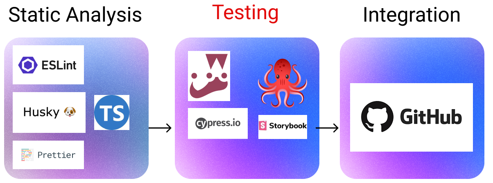
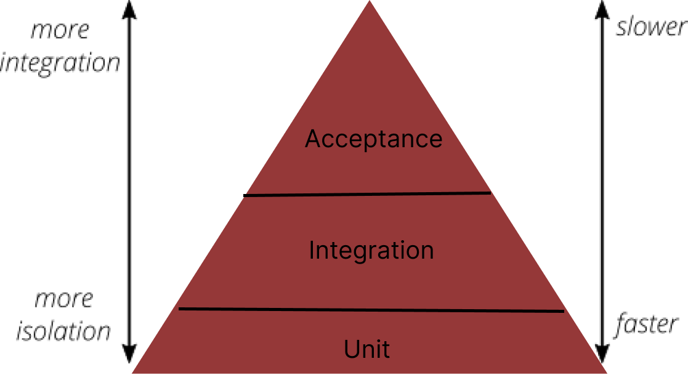
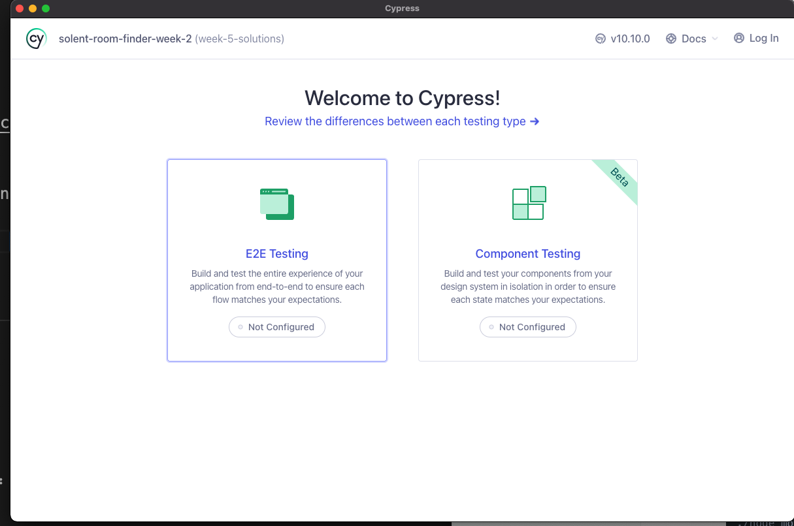
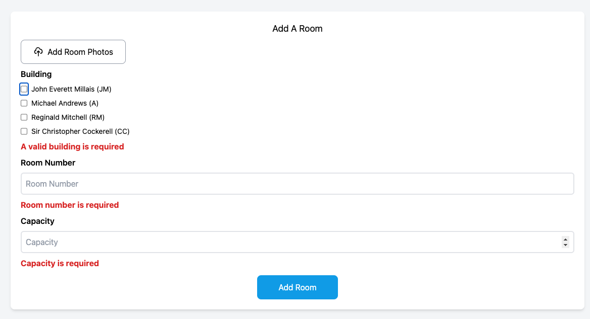

# Week 5: Introduction to Testing



Welcome Welcome to week five. This week promises to be interesting: we are going to be expanding our CI pipeline by beginning to add automated tests to our room finder application.

Throughout this week, we will be addressing the following questions:

1. What is the purpose of software testing?
2. How can I create user focused tests?
3. How can I start to develop a testing strategy for my own applications?

## Lesson Dependencies 🔨

- [You will need to ensure you have the version control tool Git installed](https://git-scm.com/book/en/v2/Getting-Started-Installing-Git)
  - You'll need to know the basic Git Commands (e.g., `checkout -b`, `push`, and `commit`)
- While you can use any text editor for this session, I recommend that you install [VS Code](https://code.visualstudio.com/download)
- You will need access to a MongDB database.
  -  You can install your own locally
  -  Use [AtlasDB](https://www.mongodb.com/atlas/database)

## TASK 0: Get the Starter Application

::: warning TASK 0: Getting Started

Since we now have a database, set up is a little more involved:

In your command line shell, run:

```shell
git clone --branch week-5-starter-code https://github.com/joeappleton18/solent-room-finder.git solent-room-finder-week-5
```

- Follow the instructions in the cloned project's `README.md` to set up your development version of the Solent Room Finder.

:::

## Defining Testing

::: tip DEFINITION
:book: **Testing**

Testing is the process of validating that software performs to its intended specification.
:::

Testing done right gives us high confidence that the code we are putting into production works. Historically, this would have been a manual process. Before a release of a software product, an army of testers would run through manual test scripts, ensuring the latest changes have not broken anything. Overall, this is a slow, painful process.

## Automated Testing

While manual testing may be unavoidable, we can automate large portions of the testing lifecycle. Automated tests are usually written by programmers to validate their own code.



> > Mike Cohn's testing pyramid is, arguably, an oversimplification.

Not all automated tests are the same; often, people will cite Mike Cohn's test pyramid in a bid to define the different types of testing:

1. Unit Tests
2. Integration Tests
3. User Interface Tests/Acceptance tests

According to the above Cohn:

**Unit tests** target small components of your system in isolation (e.g., our add room form). These tests are fast, and there should be lots of them. We can run them continuously in the background. Further, they can be easily added to our CD pipeline.

**Integration tests** target multiple components and ensure they work together; these are slightly slower than unit tests.

**Acceptance Tests** simulate, often using a browser robot, user interactions. According to Chon, these are slow and fragile. As such, we should not write many of these!

I find the above definitions troublesome. First, it is too polarising, requiring us to define the difference between tests. Second, it relies on developers correctly isolating functionality to write unit tests. To do this, we often have to mimic the functionality of dependent components, a technique known as mocking. Mocking takes a lot of thought and may not precisely simulate the behaviour of the mocked service. Third, the functionality of applications changes rapidly. This means we may end up testing granular functionality that changes or is not needed.

## We Need a Different Approach

If our testing serves the purpose of putting code into production without disrupting customers, then time on mocking obscure functionality does not meet this goal. This is especially the case with our room tracking application: it's not business or mission-critical.

I would argue for most UI-focused applications (like our room finder), we are better off starting with wider-reaching integration/acceptance tests. Also, where possible, we want to interact with real services (e.g., the database). This presents us with two clear advantages over the above testing pyramid:

1. We are testing from the perspective of a user, not a developer.
1. While the tests are slow(ish) to run, they are quick to write. For most UI-focused applications, the enhanced realism of the tests is a trade-off worth making.

In summary, by taking an integration/acceptance testing-led approach, we are forced to think from the perspective of our users.

## Introducing Cypress

This week, we will consider how we can write automated acceptance/integration tests for our room-tracking application. We'll begin by testing the home page and then move to further develop and test the create room functionality. To do this we are going to be using the Cypress testing library.

This week, we will consider how we can write automated acceptance/integration tests for our room-tracking application. We'll begin by testing the home page and then move to further develop and test the create room functionality. [To achieve this, we will be using the testing library, Cypress.](https://www.cypress.io/).

According to the developers, "Cypress enables you to write faster, easier and more reliable tests". While you can write all types of tests in Cypress, it's best know for acceptance testing (Acceptance testing is used interchangeable with **End to End Testing**). In summary, Cypress allows us to simulate user behavior by robotically controlling a browser.

## Task 1: Installing Cypress

In this task, we will set up Cypress.

::: warning TASK 1: Installing Cypress

- [We simply install Cypress via npm:](https://docs.cypress.io/guides/getting-started/installing-cypress).
- In your project's root directory run: `npm install cypress --save-dev`.
- That's it, you can now run cypress: `npx cypress open`.
- To make life easier, for future runs, create an npm script in `package.json`:

```json
...
 "scripts": {

...
    "cypress:open": "cypress open"

...
  }

```

> > `package.json`

- Run cypress: `npm run cypress:open`



> > On running `npm run cypress:open`, you should see the above browser window

- When you see the above screen click on E2E tests and go through the steps (no need to change anything). Cypress should set up some config files for you

:::

## Task 2: Testing Our Home Page

We are now ready to test our homepage. We want to try and test as much of the home page functionality as possible. We are going to be validating multiple components at the same time.

To begin with, we want to test the home page:

- shows a table containing a list of rooms
- navigates to the create form when the add room button is pressed.

There is further functionality on this page (e.g., filter rooms). However, we are yet to complete this feature.

::: warning TASK 2: Writing Our First Test

- First, ensure your database is seeded (we'll automate this moving forward): visit `http://localhost:3000/api/utility` to see your database.
- First, we need to make sure that elements on our home page are easy to programmatically find. To do this, we are going to mark the elements on our `src/pages/index.tsx` with `data-test` attributes.

- In `src/pages/index.tsx`, do the following:

```js
        ...
	  <div>
           <Link href="/create">
             <a className="blue-button" data-test="add-room-button">
               <PlusIcon className="h-5 w-5" /> Add Room{" "}
             </a>
           </Link>
	    ...
```

> > `src/pages/index.tsx`: add `data-test="add-room-button"` to our add room button. This will roughly be on line 40.

```js
       ...
        {rooms
                .filter((r) => r.capacity >= capacity)
                .map((r, i) => (
                  <tr
                    key={r._id}
                    className={(i + 1) % 2 === 0 ? "bg-gray-100" : ""} data-test="room-item"
                  >
                   ....
                ))}

		  ....

```

> > `src/pages/index.tsx`: add `data-test="room-item"` to each row that will contain a room. This will roughly be on line 64.

- Next, create your first spec file: `cypress/e2e/home.cy.ts`.
- Add the following code to `cypress/e2e/home.cy.ts`:

```js
describe("Home Page Test", () => {
  beforeEach(() => {
    cy.visit("http://localhost:3000/");
  });

  it("shows a table containing a list of rooms", () => {
    cy.get("tr").contains("HC208"); // we can just grab selectors, JQUERY style
    cy.get("[data-test='room-item']").contains("RM202");
    cy.get("[data-test='room-item']").should("have.length", 18);
  });

  it("navigates to the add room form", () => {
    cy.get("[data-test='add-room-button']").click();
    //cy.get("[data-test='bread-crumb']").should("contain", "Add Room");
  });
});

export {}; // this is to fix typescript complaint
```

> > cypress/e2e/home.cy.ts

- If all has gone well, you should now be able to run your first spec from the Cypress, browser window. You'll see a real-time replay of what has happened, along with the status of each test, very nice!

- Let's consider a few aspects of the above example:

- `describe("Home Page Test", ()`: This is the title for our test block.
- `beforeEach(() => {`: This runs before each test. I our case, we tell cypress to visit our homepage.
- `cy.get`, gets an element on the page you are testing. While you can grab any an element by its name (e.g., `cy.get("tr")`), [it's normally always better to use a `data-test` attribute](https://docs.cypress.io/guides/references/best-practices).
- Once we've grabbed an element, we can perform events or assertions (e.g., `cy.get("[data-test='room-item']").contains("RM202");` `cy.get("[data-test='room-item']").should("have.length", 18);`). For further information, see [`should`](https://docs.cypress.io/api/commands/should#Syntax) and [`contains`](<[contains](https://docs.cypress.io/api/commands/contains)>) documentation.

- To complete this task, can you un-comment `cy.get("[data-test='bread-crumb']").should("contain", "Add Room");` and make this test work. To do this you will need to add the `data-test='bread-crumb` attribute to to the breadcrumb component that provides us with navigation information.

:::

::: details solutions to the making the breadcrumb test work

```js
....
return (
    <div
      className="bg-white  mt-11 p-2 rounded-lg shadow-md flex"
      data-test="bread-crumb"
    >
...
```

> > `src/components/BreadCrumb.tsx`

:::

## Task 3: Adding Custom Cypress Commands

To make our lives easier, we can create custom Cypress commands. Notice how there is a lot of repetition in grabbing a element by the data attribute every time (e.g., `cy.get("[data-test='room-item']")), let's create a helper command to shorten this.

::: warning TASK 3: Adding Helper Commands

To add type script commands, we need to make some tweaks to our Cypress configuration.

- First create `cypress/support/index.ts` and add the following code:

```js
/// <reference types="cypress" />
/**
 * getting rid of this error: index.ts' cannot be compiled under '--isolatedModules' because it is considered a global script file. Add an import, export, or an empty 'export {}' statement to make it a module.
 */
 /** notice how I've disabled es-lint using the comment below */
/* eslint-disable */
declare global {
	namespace Cypress {
		interface Chainable {

			getByData(dataTestAttribute: string): Chainable<JQuery<HTMLElement>>;
		}
	}
}


export { };


```

> > `cypress/support/index.ts`

- Next, replace the contents of `cypress/support/commands.ts` with:

```js
/// <reference types="cypress" />

Cypress.Commands.add("getByData", (selector) => {
  return cy.get(`[data-test=${selector}]`);
});

export {};
```

> > `cypress/support/commands.ts`, don't worry too much about what this code does, we will explore in more detail later.

- You can now replace each instance of `cy.get("[data-test='*']")`, in your spec, with `ct.getData('*')` (e.g, `cy.get("[data-test='add-room-button']").click();` becomes `cy.getByData("add-room-button").click();`)

- Update your `cypress/e2e/home.cy.ts` file to use `getByData`

:::

## Task 4: Testing new functionality

::: warning TASK 4: Testing new functionality

- Increasingly, I will be getting you to engage with third-party documentation complete tasks. With this in mind, let's try and create, and test the validation functionality for our `http://localhost:3000/create` form. Within this page, I am using the `src/components/RoomForm.tsx` component to display a form. Currently, the form has no validation! At the moment, we don't want to send the data anywhere; however, we do want to validate the data.



- Can you do the following:

1. Add validation that aligns with the above image to `src/components/RoomForm.tsx`. [To do this, you should use React Hook form](https://react-hook-form.com/get-started)

   1. [Can you also add support for typescript](https://react-hook-form.com/get-started#typescript)

2. Finally, test your newly added functionality. Create a new spec: `cypress/e2e/create-cy.ts`, and add tests that check your create page:
   1. prevents not valid forms from being submitted
   2. Shows and removes errors when correct or incorrect values are entered

:::

**solutions**

:::details 4.1 Solution

```js
import {CloudUploadIcon} from "@heroicons/react/outline";
import {SubmitHandler, useForm} from "react-hook-form";
import {buildings} from "../mocks/data";

export interface RoomFormProps {
  onSubmit: SubmitHandler<RoomValues>;
}

export interface RoomValues {
  number: string;
  building: string;
  capacity: number;
  notes?: string;
  type: string;
}

export default function RoomForm(props: RoomFormProps) {
  const {onSubmit} = props;

  const {
    register,
    handleSubmit,
    formState: {errors},
  } = useForm<RoomValues>();
  return (
    <form onSubmit={handleSubmit(onSubmit)}>
      <div className="flex flex-col align-middle  space-y-2">
        <a className="gray-outline-button">
          <CloudUploadIcon className="h-5 w-5" /> Add Room Photos
        </a>
        <label className="font-semibold"> Building</label>
        <>
          {buildings.map((b, i) => (
            <div key={i} className="flex space-x-2">
              <input
                {...register("building", {required: true})}
                type="checkbox"
                value={b.code}
                data-test="building-input"
                name="building"
              ></input>
              <label className="text-sm">
                {b.name} ({b.code})
              </label>
            </div>
          ))}
        </>

        <h3 className="font-bold text-red-600">
          {errors.building && (
            <span data-test="building-error">
              {" "}
              A valid building is required
            </span>
          )}
        </h3>

        <label className="font-semibold"> Room Number</label>
        <input
          className="border-2 rounded-md p-2"
          data-test="number-input"
          type="text"
          placeholder="Room Number"
          {...register("number", {required: true})}
        />
        <h3 className="font-bold text-red-600">
          {errors.number && (
            <span data-test="number-error"> Room number is required</span>
          )}
        </h3>
        <label className="font-semibold"> Capacity </label>
        <input
          className="border-2 rounded-md p-2"
          type="number"
          placeholder="Capacity"
          data-test="capacity-input"
          {...register("capacity", {required: true, min: 5, max: 50})}
        />
        <h3 className="font-bold text-red-600">
          {errors.capacity && (
            <span data-test="capacity-error"> Capacity is required</span>
          )}
        </h3>
      </div>

      <div className="flex justify-center w-full mt-3">
        <div>
          <button data-test="submit-button" className="blue-button_no-icon">
            Add Room
          </button>
        </div>
      </div>
    </form>
  );
}

```

> > `src/components/RoomForm.tsx`
> > :::

::: details 4.2 solutions

```js
describe("Create Room Test", () => {
  beforeEach(() => {
    cy.visit("http://localhost:3000/create");
  });

  it("prevents a in-valid value from from being submitted", () => {
    // first, we check that errors are not present

    cy.getByData("building-error").should("not.exist");
    cy.getByData("number-error").should("not.exist");
    cy.getByData("capacity-error").should("not.exist");

    cy.getByData("submit-button").click();
    cy.getByData("building-error").should("exist");
    cy.getByData("number-error").should("exist");
    cy.getByData("capacity-error").should("exist");
  });

  it("removes errors when correct values are entered", () => {
    cy.getByData("submit-button").click();
    cy.getByData("building-input").eq(0).click();
    cy.getByData("building-error").should("not.exist");
    cy.getByData("number-input").type("405");
    cy.getByData("number-error").should("not.exist");
    cy.getByData("capacity-input").type("50");
    cy.getByData("capacity-error").should("not.exist");
  });
});

export {};
```

> > `cypress/e2e/create-cy.ts `

:::

## Further Reading

- [Go over the Cypress tutorial](https://learn.cypress.io/)
- [Watch this quick video for a reason no to unit test](https://www.youtube.com/watch?v=ZGKGb109-I4)
- [Watch the DHH talk on testing](https://www.youtube.com/watch?v=5hN6OZDyQtk)
