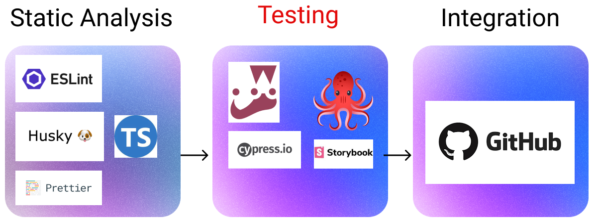

# Week 6: Database Testing 



This week, I want to continue to consider our testing strategy for our Solent room tracking application. However, as you'll find out, our room finder has been further developed;  we can now create, delete and update rooms and even filter them. In short, our application can manipulate data in a database. 

While the hacker and developer in me appreciate the speed at which our room tracker is progressing, the pragmatic engineering side has concerns. The fact that our program manipulates a database presents a testing challenge. We need a way of allowing our tests to reliably and consistently interact with the database. This week, we will address this challenge by addressing the following questions:

1. How can I set up a test database?
1. How can I integrate tests into my CI/CD pipeline?

## Lesson Dependencies 🔨

- [You will need to ensure you have the version control tool Git installed](https://git-scm.com/book/en/v2/Getting-Started-Installing-Git)
  - You'll need to know the basic Git Commands (e.g., `checkout -b`, `push`, and `commit`)
- While you can use any text editor for this session, I recommend that you install [VS Code](https://code.visualstudio.com/download)
- You will need access to a MongDB database.
  -  You can install your own locally
  -  Use [AtlasDB](https://www.mongodb.com/atlas/database)

## TASK 0: Get the Starter Application

Since we now have a database, setup is a little more involved:

In your command line shell, run:

```shell
git clone --branch week-6-starter-code  https://github.com/joeappleton18/solent-room-finder.git week-6

```

- Follow the instructions in the cloned project's `README.md` to set up your development version of the Solent Room Finder.

::: tip Important Point
:star: **Taking too long to install NPM dependencies at university**? [This is an odd issue, as the dependencies only take about 30-seconds to install on my, much slower, home network. To speed up the university installation you may just want to download the zip file of the project with all installed dependencies.](https://ssu-my.sharepoint.com/:f:/g/personal/joe_appleton_solent_ac_uk/Eoq4m_ZibL1KviE7247Y01oBxBssJkRCaVQYB5h5LHm1nw)

:::

## A strategy for testing

First, let's consider our testing strategy for this application. Since this is a non-business critical web application, I am assuming the following position: 

- Test after the features are developed (e.g., we are not practicing TDD). I find this helps us focus; we are not continually jumping between features and tests. 
- Take a user-first approach to testing. 
- Test outcomes, not implementation. For instance, test that an error box gets shown but not the message itself.  
- Start with wide-reaching integration tests (e.g., create, update, and delete a room). 
- You should note that this is just my stance on testing this kind of application. 
- Test on an environment that, as much as possible, mirrors production. 
- Avoid mocking functionality.

Your testing strategy may differ, and as long as it is well justified, that's fine! 

## TASK 1: Considering a Testing Strategy for the Assessment Scenario

::: warning TASK 1: Considering a Testing Strategy for the Assessment Scenario 

[In groups, or individually, list out in bullet points the testing strategy that you aim to take for the assessment scenario.](./../assessment/scenario.md)

:::

## Solent, He Have a Problem!


>> Our tests are fragile.

We have a problem with our current test setup! Don't believe me: 

- delete a room, by clicking the rubbish bin by a room in the room table. 
- re-run your tests: `npm run cypress:run`
- you  should now have two failed tests, ouch!

The culprit is this assertion in `cypress/e2e/home.cy.ts`:

```js

it("shows a table containing a list of rooms", () => {
 
 ...
 cy.getByData("room-item").should("have.length", 18);
}	

```
>> `cypress/e2e/home.cy.ts`

Since we deleted a room, we now have 17 rooms in our table, not 18! We could re-seed the database; however, we don't necessarily want to re-set the database just to run the tests. In summary, we can't reliably run the tests against an unpredictable, changing database

## The Solution: ARRANGE-ACT-ASSERT


>> A pattern for testing

Above is a diagram of the common testing pattern arrange, act, assert.  Following this pattern, we must, before we act, arrange our application's state for testing. In our case, this means re-seeding the database. However, as we explored above, we don't want to re-seed our development database. 


>> The different environments we will, eventually, set up. Each environment must be stand alone.

In order to implement our arrange, act, asset pattern, we need a dedicated test environment. In doing so, we can arrange this environment for acts and assertions.  Crucially, the test environment won't impact our development or production environments. 

Luckily, Next.js comes allows us to easily manage multiple environments. You have already taken advantage of this functionality. Currently, your application uses the `.env.local` file to see your enviroment. Next.js, however, allows us to use multiple environment files. [According to the documentation, Environment variables are looked up in the following places, in order, stopping once the variable is found](https://nextjs.org/docs/basic-features/environment-variables)

1. process.env
2. .env.$(NODE_ENV).local
3. .env.local (Not checked when NODE_ENV is test.)
4. .env.$(NODE_ENV)
5. .env

::: tip DEFINITION
:book: **NODE_ENV**

`NODE_ENV` is an environment variable that was popularised by the express framework.
:::

According to the above, we just need to set `NODE_ENV` ti testing, and this means `.env.testing` will be used to populate out environment. 


## Task 2: Setting up Multiple Environments

::: warning TASK 2: Setting up Multiple Environments


- We need to change `process.env.NODE_ENV` to `test`. To reliably do this across different operating systems we are going to install `cross-env`.
  - run: `npm install --save-dev cross-env`
- Next, set up in  `package.json` a script that runs our application in the test environment.

```json 

... 
"scripts": {
... 

 "test": "cross-env NODE_ENV=test  next dev",
...

}


```
>> `package.json`

- Next, set up a `.env.test` file in the root of your project, and add a URL to the test database. Since we are using MongDB you just need to change the name of the database from `rooms` to something else (e,g., `room_test`). Here is what my connection string looks like: 

```json
MONGODB_URI=<url>/rooms_test?retryWrites=true&w=majority
```
  
- If your application is currently running in command line, stop it (CTRL/CMD C).

- Run your application in test mode: `npm run test`
- You should see after you run the command: `info  - <path>.env.test`
- You can now seed you database: visit `http://localhost:3001/api/utility`. You are seeding your test database, not your development database. 

:::

Now we have a test environment. Let's consider how we might use it to arrange tests. Crucially, each test should be stand-alone and not be dependent on other tests.  After each test runs, the database should return to its original known state (18 records). 


Let's consider how we might achieve this in Cypress. 

## Task 3: Arranging Tests

::: warning Arranging Tests

- Open your Cypress console: 
-  `npm run cypress:open`
- we can place commands in `cypress/support/e2e.ts` that run before every test. Let's re-seed our database before each test. In `cypress/support/e2e.ts` add:

```js

beforeEach(() => {
  cy.log("I run before every test in every spec file!!!!!!");
  cy.request("http://localhost:3000/api/utility/"); //resets database after every test
});

```
>> `cypress/support/e2e.ts`

:::

- Recall, the route `http://localhost:300/api/utility/` seeds our database. You can see the code behind this by looking at `src/pages/api/utility/index.ts`


- Re-run your tests from the cypress console. If you click on one of the green ticks you should see `I run before every test in every spec file!!!!!!`

- Cypress recommend you set a base url, now seems like a good time to do this. In `cypress.config.ts` add a `baseURL` property:

```js
import {defineConfig} from "cypress";

export default defineConfig({
  e2e: {
    baseUrl: "http://localhost:3000",
    setupNodeEvents(on, config) {
      // implement node event listeners here
    },
  },
});

```
>> `cypress.config.ts`

- You can now remove `http:localhost:3000` from your paths (e.g., `http:localhost:3000/create` becomes `/create` ). You'll need to update the paths in: `cypress/support/e2e.ts`, `cypress/e2e/create.cy.ts`, and `cypress/e2e/home.cy.ts`. For home and create this just involves updating the path in the forEach block. 
- Restart the cypress console for these updates to take effect.

## Task 3: Arranging Tests

::: warning  Adding some more tests

- Now that we have a test environment set up let's write some more tests. Create the following files:

- `cypress/e2e/delete.cy.ts`
- `cypress/e2e/update.cy.ts`

Have a go at writing the following tests:

**You will need to add `data-test=` attributes to elements your need to test.**  

**cypress/e2e/create.cy.ts** 

- add the test `it("creates a new room", ()`
- use the test above to work out how to fill out the form
- After submission
- Check the success alert exists. This is what my code looks like: `cy.getByData("success-alert").should("exist");`
- Visit the home page: `cy.visit("/");` and check there are 19 rooms in the table: `cy.getByData("room-item").should("have.length", 19);`
- Check the room you created is in the table. Here is what my code looks like: `cy.getByData("room-item").contains(/RM1/);`


**cypress/e2e/delete.cy.ts**

- add the test `it("deletes a room", () => {`
- check that the table has 18 rooms: `cy.getByData("room-item").should("have.length", 18);`
- `cy.getByData("delete-icon").eq(0).click();`

**cypress/e2e/create.cy.ts (if you fly through the above)**

- work out how to test that update works

[If you did not get very far with the above: you can grab the completed test files from here](https://github.com/joeappleton18/solent-room-finder/tree/week-6-solutions)

:::

## Running Cypress in Continuous Integration (CI)

Would it not be great when we made a pull or pull request our tests ran as a GitHub workflow? Well! We can do just that. For the final task, let's consider how this might work. 


## Task 4: CI Integration

:::warning Task 4: CI Integration

Create `.github/workflows/cypress.yaml` and add the following code: 

```yaml
name: E2E on Chrome

on: [push, pull_request]

jobs:
  install:
    runs-on: ubuntu-latest
    steps:
      - name: Checkout
        uses: actions/checkout@v2

      - name: Cypress run
        uses: cypress-io/github-action@v3
        with:
          browser: chrome
          build: npm run build
          start: npm run start
          wait-on: "http://localhost:3000"
        env:
          MONGODB_URI: "<add the url to your testing database>"
```
>> `.github/workflows/cypress.yaml`: ensure you update your  MONGODB_URI. If you want more security consider [environment secrets](https://docs.github.com/en/actions/security-guides/encrypted-secrets). Above, we build our application and then use `cypress-io/github-action@v3` to run the tests in the chrome, headless browser, pretty cool!

- Next commit and deploy to a GitHub repo. You will need to set up your own repository, then go through the following process:

```command
git add -A 
git commit -m "week 6 lesson completed"
git remote remove origin 
git remote add origin <your repo url>
git push origin week-6-starter-code (you may need to append --force)
```
 
- If all has gone well you should she a green tick on your repository. When you click on it, you'll see that your tests ran 🎊 🎊 🎊 🎊 🎊 🎊 🎊🎊

- Finally, it's always a nice touch to add badges to your `README.MD` file. Git hub actions makes this easy, add the following to your `README.md`:

``


:::