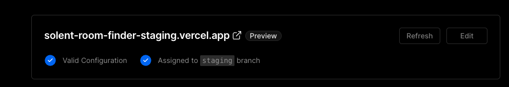
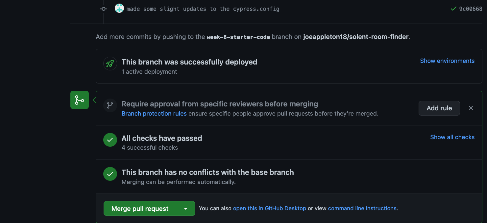

## Week 8: Closing the CI/CD Loop

This week, we are going to address the following question: 

- How can teams manage and deploy new software features using Git?

Unfortunately, the answer to the above question is "it depends". To answer it, we will explore two  branching strategies: based on gitflow.

## Lesson Dependencies 🔨

- [You will need to ensure you have the version control tool Git installed](https://git-scm.com/book/en/v2/Getting-Started-Installing-Git)
  - You'll need to know the basic Git Commands (e.g., `checkout -b`, `push`, and `commit`)
- While you can use any text editor for this session, I recommend that you install [VS Code](https://code.visualstudio.com/download)
- You will need access to a MongDB database.
  -  You can install your own locally
  -  Use [AtlasDB](https://www.mongodb.com/atlas/database)
- [You need a Cloudinary account](https://cloudinary.com/)
- [You need a GitHub account](https://www.github.com)
- [You will need to have signed up to https://vercel.com/ and deployed a version of the solent room finder](../week-7/#task-2-deploying-our-application)

## Task 0: Getting Started 

::: warning TASK

This week, we are going to work in small groups to set up a CI/CD solution. For this task:

1. Form a group 
1. [Ensure that one of your team members has a deployed version of the Room Finder application. If not, complete the final task from last week.](../week-7/#task-2-deploying-our-application) 
1. The group member that has deployed a version of the project should add their team members as contributors to the GitHub project of the deployed application.
1. All team members should clone the repo and set up a development version of the Room Finder application 
    

:::

## Feature branching is controversial 

::: tip DEFINITION
:book: **Feature Branch**

[The core idea behind the Feature Branch Workflow is that all feature development should take place in a dedicated branch instead of the main branch. This encapsulation makes it easy for multiple developers to work on a particular feature without disturbing the main codebase. It also means the main branch will never contain broken code, which is a huge advantage for continuous integration environments.](https://www.atlassian.com/git/tutorials/comparing-workflows/feature-branch-workflow)

:::

>> An example of the git flow branching strategy ([source](https://nvie.com/posts/a-successful-git-branching-model/)). As you can see, it's some what complex. 

[Feature branching, unfortunately has a bad reputation. This is mostly due to, historically, teams using a technique called GitFlow, popularised by Vincent Driessen](https://nvie.com/posts/a-successful-git-branching-model/).  However, in recent times, this technique has come under some criticism. The root of these critiques is its complexity and the worry of old, unmerged feature branches. Old branches are particularly troublesome as they are prone to merge into conflict hell! This has led to Vincent Driessen suggesting that teams should "adopt a much simpler workflow (like GitHub flow) instead of trying to shoehorn git-flow into your team".

[According to GitHub, "GitHub flow is a lightweight, branch-based workflow.  GitHub flow is useful for everyone, not just developers". Therefore, it seems like a good choice for our Room Finder application.](https://docs.github.com/en/get-started/quickstart/github-flow)

## Task 1: Discussing the Pros and Cons of Branching 

::: warning Task 1: Discussing the Pros and Cons of Branching  
Before we start the practical portion of this week's session. In your groups,  research and discuss different Git team branching strategies. 
:::

## Task 2: Setting up GitFlow

For this task, we are going to work our small groups to set up two different team workflows: a feature branch workflow, and a simplified direct push to the staging branch.  Using Vercel, we can automatically deploy a staging version of of project each time we commit to the staging branch. 

## 2.1: Creating a Staging Branch

For both of these strategies, you are going to need a staging branch. One team member should: 

- Locally, check out a new staging branch: git checkout -b staging 
- Push this branch upstream: git push origin staging
- [Work out how to protect the staging and main branch so no one can push to these branches.](https://docs.github.com/en/repositories/configuring-branches-and-merges-in-your-repository/defining-the-mergeability-of-pull-requests/about-protected-branches)

## 2.3: Staging Branches Auto Deploys

If you check your https://vercel.com/ project dash, you should see that Vercel attempted to deploy your staging branch. However, this deployment probably failed. In fact, for every branch, you create Vercel will create a custom deployment for you!

Currently, our application deploys on a random URL. This is a problem in staging, as we need to test authentication. For OAuth to work, we need a stable redirect URL.  This is a very easy challenge to solve:

>> My staging branch

1. To create a staging environment, you'll first need to add a custom domain to your project. In Vercel, You can add a domain by clicking the "Settings" tab from a Project and selecting the Domains section. From the Domains section, you can assign a domain to the appropriate Git branch. The domain will need to be `<staging-name>`.vercel.app: mine is [solent-room-finder-staging.vercel.app](solent-room-finder-staging.vercel.app).

<iframe src="https://app.tango.us/app/embed/aa7f903b-5671-4505-ba79-3efe9551eca5?iframe" sandbox="allow-scripts allow-top-navigation-by-user-activation allow-popups allow-same-origin" security="restricted" title="Tango Workflow" width="100%" height="600px" referrerpolicy="strict-origin-when-cross-origin" frameborder="0" webkitallowfullscreen="webkitallowfullscreen" mozallowfullscreen="mozallowfullscreen" allowfullscreen="allowfullscreen"></iframe>

2. Now you have a stable domain, you can set up a new Github OAuth application.

2. You can now begin to set up the staging environment:
   1. In your Vercel project setting, set the following environment vars for your staging branch):
      1. NEXTAUTH_URL=your staging URL
      2. NEXT_PUBLIC_TESTING= have no value in it
      3. MONGODB_URI= a staging database url (use AtlasDB)
      4. GITHUB_SECRET= a generated secret from your OAuth application
      5. GITHUB_ID= your OAuth Applications ID
   
Finally, we want any further preview branch to not have auth. To achieve this add a `NEXT_PUBLIC_TESTING = true`  environment variable for your preview environment. Since we have set this environment variable = "" (no value) in staging already, this won't impact our staging environment. In the same vein: set a `MONGODB_URI` environment variable up for preview branches.  

## 2.4: First Feature Branch Flow

One or more team members should check out (locally) a new feature branch: `git checkout -b `myGreateFeature`. 

- Make some token changes to the application and a few commits. 

- Push this branch to the origin: `git push origin `myGreateFeature`.

>> this is what your pull request should look like

- Figure out how to raise a pull request into the staging branch. If all has gone well, you should see your GitHub workflows running.  You'll also get a sample deployment of your application. 

- If all the tests pass and the preview deployment looks good, then merge and close the pull request. 

- Your application should now be in staging. To deploy to production, you need to raise a further pull request from staging into master. 

## 2.5 Try a simplified flow

I don't mind the above flow; it provides a stable branch you can share with the product owner. However, you may want to simplify it more. As a final task, set up a workflow where all team members push directly to staging. When the release is ready, raise a pull request directly into the main branch. 
