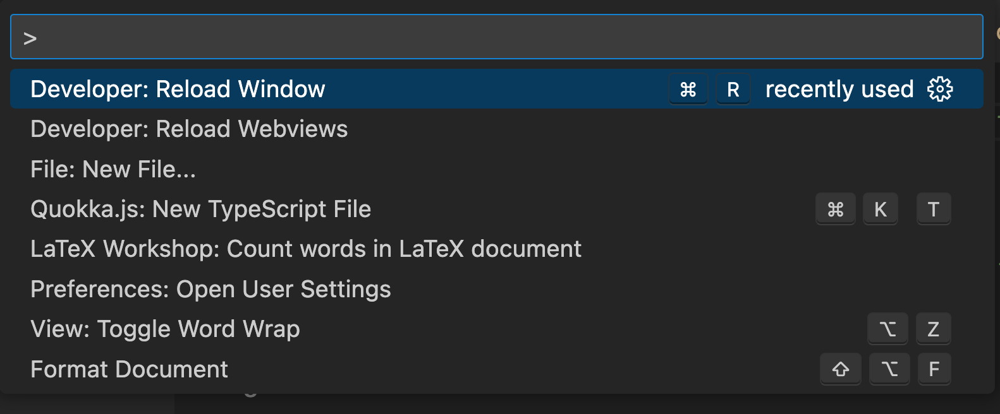
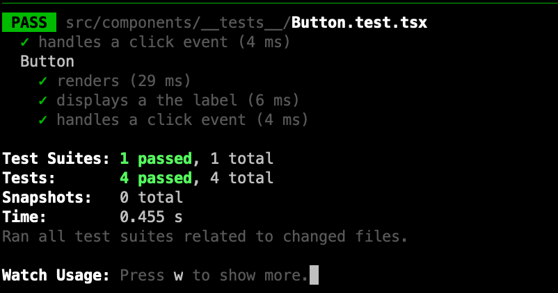

# Week 9: Unit Testing

This week we shall add some unit tests to our room tracking application. Specifically, we will answer the following questions:

1. What are the benefits of unit tests?
2. What is a unit of code?
3. How can I unit test React applications?

## Lesson Dependencies 🔨

- [You will need to ensure you have the version control tool Git installed](https://git-scm.com/book/en/v2/Getting-Started-Installing-Git)
  - You'll need to know the basic Git Commands (e.g., `checkout -b`, `push`, and `commit`)
- While you can use any text editor for this session, I recommend that you install [VS Code](https://code.visualstudio.com/download)
- You will need access to a MongDB database.
  - You can install your own locally
  - Use [AtlasDB](https://www.mongodb.com/atlas/database)
- [You need a Cloudinary account](https://cloudinary.com/)
- [You need a GitHub account](https://www.github.com)

## TASK 0: Get the Starter Application

If you have a working version of the room finder with authentications, you don't need to get a new version of the project. If not,

In your command line shell, run:

```shell
git clone --branch week-9-starter-code  https://github.com/joeappleton18/solent-room-finder.git week-9
```

[Next, follow the setup steps from week 7](../week-7/#task-0-1-get-the-starter-application)

::: tip DEFINITION
:book: **Coverage**

Test coverage is given details about the level to which the written coding of an application has been tested.
:::

I was in two minds about including unit tests in this course. After all, Cypress already offers us good test coverage. Moreover, we achieve this coverage with minimal effort. As such, Cypress could be your one and only, go to automation testing for your assessment. However, Cypress can't test the granular functionality of an application (e.g., does a spinner show when the application is in a loading state?). Furthermore, many people (not me), swear by unit testings; particularly in the context of TDD.

The benefits of unit testing are:

- They are fast.
- They can guide the design of our applications.
- They act as documentation.
- They make you slow down and think about your application.
- They can be a fun way to increase understanding of the code base.
- It's easier, than integration testing, to test edge cases (e.g, what happens if we get a server error)

The cons of unit testing:

- They can be complex to write.
- They can slow down the development process.
- We need more unit tests to achieve the same level of coverage as integration tests.
- As you'll find out today, they are tricky to retrospectively add.

## Task 1: Unit Testing Discussion

In small groups consider:

1. Why we test?
1. In what context does unit testing meet our testing needs?

## What is a Unit

In order to derive a unit testing strategy, you must first answer the following questions:

1. What is a unit in the context of my application?
2. Should this unit interact with other units of code?

In the context of our room tracking application, the answer to question one is simple. As we are using NextJS, a unit is simply a component.

Question two is open to interpretation. Components rarely live in isolation; they interact with third-party libraries, databases, and components. We have a few choices:

- We can isolate our components for testing. This involves mocking (simulating) the functionality of external interactions. I am not a fan of this approach. It's time-consuming and mocks often don't perfectly resemble a third-party interaction.
- We can part mock interactions (e.g., IO and Auth). This ensures tests are both fast to run and write.

## React Testing Library

[We will use the popular, React Testing library for our unit tests. According to, Kent Dod, its creator, "the React Testing Library is a very light-weight solution for testing React components. It provides light utility functions on top of react-dom and react-dom/test-utils, in a way that encourages better testing practices. Its primary guiding principle is:](https://testing-library.com/docs/react-testing-library/intro/)

<blockquote class="twitter-tweet"><p lang="en" dir="ltr">The more your tests resemble the way your software is used, the more confidence they can give you.</p>&mdash; Kent C. Dodds 🌌 (@kentcdodds) <a href="https://twitter.com/kentcdodds/status/977018512689455106?ref_src=twsrc%5Etfw">March 23, 2018</a></blockquote> <script async src="https://platform.twitter.com/widgets.js" charset="utf-8"></script>

Let's see if we can add some unit tests to our application.

## Task 1.1 : Installing the React Testing Library

First we need to use NPM to install the react testing library. Run the following command in the root of your project:

```shell
npm install @testing-library/jest-dom @testing-library/react @testing-library/user-event jest jest-environment-jsdom @types/testing-library__jest-dom  eslint-plugin-testing-library
```

> > Make sure you copy the full string!

You may be thinking, that's a lot of dependencies, and you'd be right. Unlike Cypress, react testing library does not act like a robot interacting with our application. In contrast, it integrates with our code base. Above, we installed, react testing library and some types (for type script support). Further, we added Jest to run the tests. React Testing Library and [Jest](https://jestjs.io/) go hand in hand.

, Next, we need configure our application. Create the following files in the route of your room finder project:`boostrapTests.js`, `jest.config.js`, `setupTests.ts` and `jest.setup.ts`. Add the following code to these newly created files (no need to fully understand this code):

```js
// eslint-disable-next-line @typescript-eslint/no-var-require
const nextJest = require("next/jest");

const createJestConfig = nextJest({
  // Provide the path to your Next.js app to load next.config.js and .env files in your test environment
  dir: "./",
});

// Add any custom config to be passed to Jest
const customJestConfig = {
  setupFilesAfterEnv: ["<rootDir>/jest.setup.ts"],
  testEnvironment: "jest-environment-jsdom",
};

// createJestConfig is exported this way to ensure that next/jest can load the Next.js config which is async
module.exports = createJestConfig(customJestConfig);
```

> > `jest.config.js`

```js
import "@testing-library/jest-dom/extend-expect";
```

> > `jest.setup.ts`

```js
import "@testing-library/jest-dom";
```

> > `setupTests.ts`

```js
import "@testing-library/jest-dom";
```

> > `bootstrapTests.ts`

Next, we need update `.eslintrc.json` to support linting for our tests:

```js
{
...
"root": true,
...
"plugins": ["@typescript-eslint", "testing-library"],
...
 "overrides": [
    // Only uses Testing Library lint rules in test files
    {
      "files": [
        "**/__tests__/**/*.[jt]s?(x)",
        "**/?(*.)+(spec|test).[jt]s?(x)"
      ],
      "extends": ["plugin:testing-library/react"]
    }
  ]
}
```

> > `.eslintrc.json`. [It may be easier to copy over this file with the contents of the week 9 solution](https://github.com/joeappleton18/solent-room-finder/blob/week-9-solutions/.eslintrc.json)

Next, we need to make the testing library's types available to our wider program. Within `tsconfig.json` extend your 'include' array to:

```
...
"include": [
    "bootstrapTests.ts",
    "next-env.d.ts",
    "**/*.ts",
    "**/*.tsx"
  ]
...
```

> > `tsconfig.json`

Finally, we need to set up a script in our `package.json` file to run our tests:

```json
{
	...
	 "scripts": {
	  ...
		"test:unit": "jest --watch"
		...
	 }

	 ...
}

```

> > `package.json` : update the scripts section

::: tip Important Point
:star:



> > Running the reload command should get rid of those pesky red lines!

You may get some squiggly TS warnings/errors in your testing files. These are not run-time errors, and your tests will still run. To fix these errors, assuming you are using VS code, press `CTRL/CMD Shift P` type and then run "reload window".

:::

## What to test

Phew, we are now ready to write some unit tests.

We can start testing as low down on our applications component tree as we like. Let's first test our `src/components/Button.tsx`. First, we need to create our test file.

Tests should be called, `<name>`.test.tsx and we can place them anywhere in our application. However, I like to place them in a `__tests__` folder. Further, I like to place the test close to the components I am testing. With this in mind, let's create the following test file:

`src/components/__tests__/Button.test.tsx`

Add the following code to `Button.test.tsx`:

```js
import { fireEvent, render, screen } from "@testing-library/react";
import Button from "../Button";
// we can organise tests into describe blocks
describe("Button", () => {
  // this tests the component renders
  it("renders", () => {
    render(<Button label="Click Me" onClick={() => "clicked"} />);
    // like Cypress we can grab elements and assert they are in teh document
    expect(screen.getByRole("button")).toBeInTheDocument();
  });

  it("displays a the label", () => {
    render(<Button label="Click Me" onClick={() => "clicked"} />);
    expect(screen.getByRole("button")).toHaveTextContent("Click Me");
  });

  /**
   * I don't really like these sorts of tests.
   * You'll often see them, and they effectively
   * test the implementation of react.
   */

  it("handles a click event", () => {
    render(<Button label="Click Me" onClick={() => "clicked"} />);
    expect(screen.getByRole("button")).toHaveTextContent("Click Me");
  });
});

/**
 * This is slightly better. We are now testing wider functions
 */
it("handles a click event", () => {
  const handleClickMock = jest.fn();
  render(<Button label="Click Me" onClick={handleClickMock} />);
  fireEvent.click(screen.getByText("Click Me"));
  expect(handleClickMock.mock.calls.length).toBe(1);
});
```

> > `src/components/__tests__/Button.test.tsx`

You should now be able to run your test: `npm run test:unit`



> > tests running

If all has gone well, you should see the above prompt in your terminal. The greate thing about unit tests is we can run them continually in the background.

Above, you can see we are operating similarly to Cypress. However, the fundamental difference is we can now test units of code in isolation. Furthermore, we can do what's known as mocking. Mocking is used in unit tests to replace the return value of a class method or function. Notice on line 33, we set up a mock function: `const handleClickMock = jest.fn();`. This mock is sometimes known as a spy as it tracks how many times it has been and how it's been called. We can then run assertions against this information: `expect(handleClickMock.mock.calls.length).toBe(1);`. In the case of this test, we assert that clicking the button invokes the callback method we have passed in.

## Task 2: Button Test

Can you implement the `Button` test above. Further, can you write tests for the alert and bread crumb component.

## Task 3: Room Form Test

Let's consider a slightly more complex example: `src/components/RoomForm.tsx`

1. First things first, you'll notice that `src/components/RoomForm.tsx` communicates with
   our `src/hooks/useNextAuth.ts`. When we run our tests, the testing library sets our `process.env.NODE_ENV` to test. Like we do with our Cypress test, we will disable auth for testing. Update `src/hooks/useNextAuth.ts`:

```js
...

if (process.env.NEXT_PUBLIC_TESTING || process.env.NODE_ENV === "test") {
  // eslint-disable-next-line @typescript-eslint/ban-ts-comment
  //@ts-ignore
  session = () => ({data: {session: true, user: {id: 1}}});
}
...

```

> > `src/hooks/useNextAuth.ts`

2. Now that's out the way see if you can work out how to test:

1. That we can set a custom button label (this is pretty straight froward)
1. The form allows a Room to be updated:


    - you'll need to set up spy `const handleClick = jest.fn();`
    - set up a mock room to pass into the form:

```js
const room = {
  number: "208",
  building: "HC",
  capacity: 10,
  type: { code: "pc", name: "PC Lab" },
  photos: [],
};
```

> > A mock room to pass into our component

- You can now think about rendering the `<RoomForm/>`

```

 render(
  <RoomForm onSubmit={handleClick} values={room} label="Update Room" />
);

```

1. Figure out how to update a value in the form, submit the form, and check that the `handleClick` mock is called with the updated value. [You should work out how to use the toHaveBeenCalledWith](https://jestjs.io/docs/expect#tohavebeencalledwitharg1-arg2-)

## Task 4: Integrating our Tests into the CI/CD Pipeline

Currently, our unit tests run in the background, enhancing our developer workflow.

We can now start using jest in our CI/CD environment. The first thing you may want to do is append the `npm run test:ci` to your git pre-commit hook. Add `npm run test:ci` to the bottom of your `.husky/pre-commit` file. Now, if you make a commitment, your tests will run.

Next, we can add `npm run test:ci` to `.github/workflows/main.yaml` add the following lines to the end of this file:

```
	- name: Run Tests
        	run: npm run test:ci
```

> > `.github/workflows/main.yaml`
